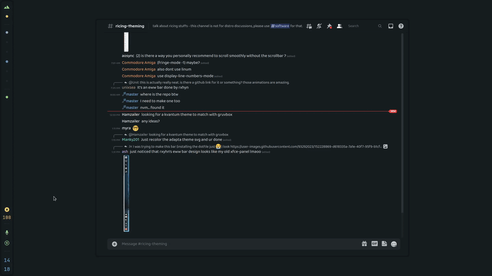

<h2 align="center">Everblush Discord Theme</h2>

<p align="center"> 
 

 
</p>

## Preview 



## Installation

- If you are using [discocss](https://github.com/mlvzk/discocss) just move the file into `$HOME/.config/discocss/` with the name `custom.css` and open disco using `discocss`

- If you are using better discord you should be able to paste the theme content in the settings of discord.

# Note 
some css class might not match cause of the language of the client, to solve this just open

`~/.config/discord/settings.json` and add this line to the config

```"DANGEROUS_ENABLE_DEVTOOLS_ONLY_ENABLE_IF_YOU_KNOW_WHAT_YOURE_DOING": true```

then open discord and press `CTRL + SHIFT + I` to open the insepctor and find the right class you need to replace.

## Credits 💝
- [@nautilor](https://github.com/nautilor). 
